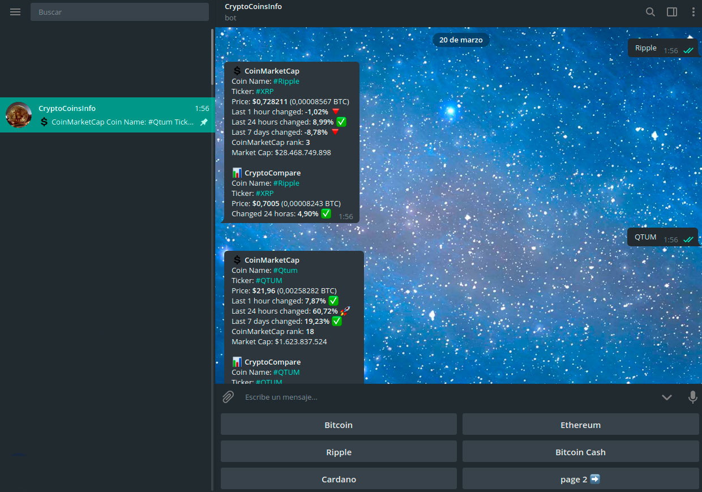

# CryptoCoinsInfoBot v2

[@CryptoCoinsInfoBot](https://t.me/CryptoCoinsInfoBot "@CryptoCoinsInfoBot") - enjoy it!

This is a simple version of a Telegram Bot, had been used [pyTelegramBotAPI Library](https://github.com/eternnoir/pyTelegramBotAPI "pyTelegramBotAPI Library GitHub Repository"), you can use *start_polling* or *webhook* updates methods for recieve the messages (see cryptocoinsinfobot.py code)

For use unicode emojis had been used [Emoji Library](https://github.com/carpedm20/emoji "Emoji for Python.")

APIs of [CoinMarketCap](https://coinmarketcap.com/api/ "CoinMarketCap") and [CryptoCompare.com](https://www.cryptocompare.com/api/ "CryptoCompare.com") are used

---

#### Use:

For recive an actual price of a crypto coin use a keyboard with some coins or send to the bot a name or ticket, e.g.:

> VeChain
> 
> OMG
> 
> DigixDAO

#### Settings:

Bot Settings are in the file cryptocoinsinfo/config.py:

*  put your *TOKEN_BOT* and *YOUR_TELEGRAM_ALIAS* for users' feedback here.

* script are downloading two json files with API info (from Coinmarketcap and Cryptocompare) each *TIME_INTERVAL* seconds

* script are using log rotations *TimedRotatingFileHandler*

---

Screenshot of the bot work:

